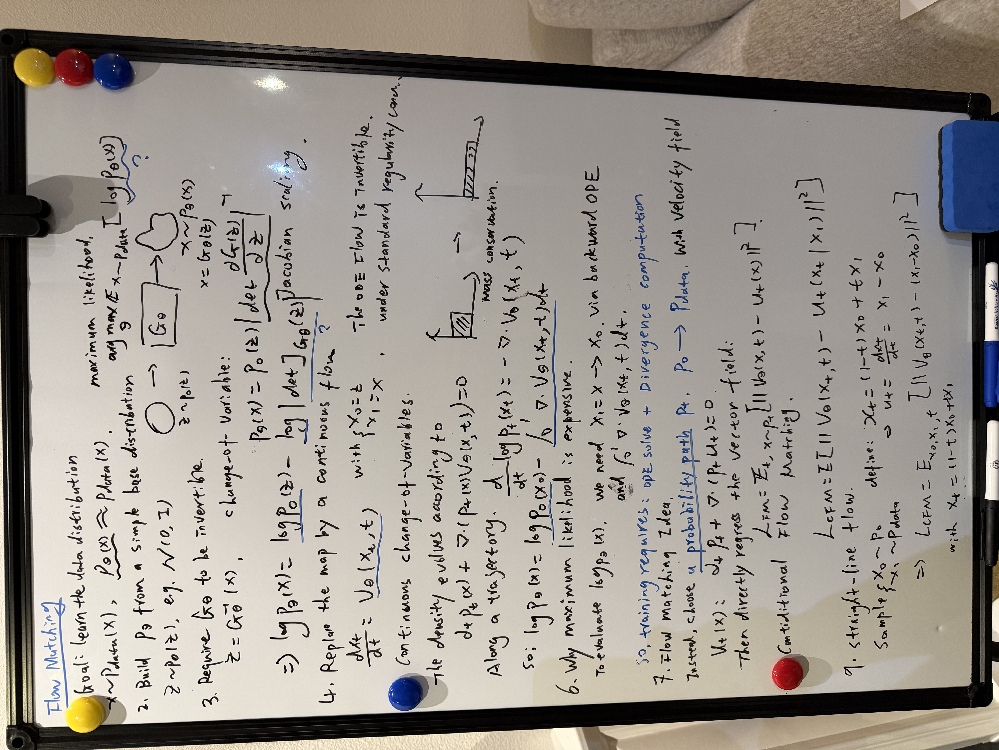

# Flow matching for generative control

We want a generative controller: given the current observation $o$, predict a plausible chunk of future actions $a$. Start with the demonstration dataset $\mathcal D=\{(o_i,a_i)\}$, and learn the conditional action distribution $p_{\mathrm{data}}(a\mid o)$.

## 1. What are we trying to model?

At robot timestep $\tau$, let $o_\tau$ contain the available observations, such as camera images, proprioception, or a history of these measurements. One training target is an *action chunk* of horizon $H$:

$$
a_\tau=(u_\tau,u_{\tau+1},\ldots,u_{\tau+H-1})\in\mathbb R^{H\times d_u},\qquad
\mathcal D=\{(o_i,a_i)\}_{i=1}^N.
$$

Here $u_\tau\in\mathbb R^{d_u}$ is one action; $a$ denotes the whole chunk. We can flatten it into $\mathbb R^d$, with $d=Hd_u$, for the derivation. The pairs describe a joint data distribution $p_{\mathrm{data}}(o,a)$. At deployment, the observation is given, so our target is its conditional distribution:

$$
\pi_\theta(a\mid o)\equiv p_\theta(a\mid o)\approx p_{\mathrm{data}}(a\mid o).
$$

We have paired examples, not an evaluable formula for this density. Sampling $(o,a)\sim\mathcal D$ means drawing an observed pair; it does not mean sampling the observation and action independently. Overlapping chunks from the same trajectory can also be correlated.

**Why a distribution?** For the same observed obstacle, demonstrations might pass on either side. Predicting the mean chunk can average incompatible behaviors. A conditional distribution can preserve both options, while jointly modeling the actions within each chunk.

[Interactive figure: Action samples for a fixed observation, a Gaussian baseline, and the toy conditional action density](../figures/flow-matching.html?view=data)

  A scalar illustration of $p_{\mathrm{data}}(a\mid o)$ at a fixed observation. Tick marks are demonstrated action values. The full policy models an entire action chunk jointly; this plot only illustrates multimodality in one dimension. Reveal the toy density to compare it with a single Gaussian.

For this illustrative observation, use two modes:

$$
p_{\mathrm{data}}(a\mid o)=\tfrac12\mathcal N(a;-2,0.45^2)+\tfrac12\mathcal N(a;2,0.45^2).
$$

The analytic density is known only in this toy example. In a real dataset, different observations imply different action distributions; one network must learn that dependence.

## 2. Define the policy through a sampler

For a fixed observation $o$, transform an easy random variable into an action chunk:

$$
Z_0\sim p_0=\mathcal N(0,I_d),\qquad
\hat a=T_\theta(Z_0;o),\qquad
p_\theta(\cdot\mid o)=\big(T_\theta(\cdot;o)\big)_\#p_0.
$$

The pushforward symbol $\#$ means: draw noise, transform it using the observation, and consider the distribution of the output chunks. For any region $B$ of action-chunk space,

$$
\Pr(\hat a\in B\mid o)=\int_{\{z:T_\theta(z;o)\in B\}}p_0(z)\,dz.
$$

The observation supplies context; the noise supplies randomness among possible chunks. We generate actions conditioned on observations, rather than generating observation–action pairs. The [MIT flow and diffusion notes](https://arxiv.org/html/2506.02070v1#S1) develop this conditional sampling viewpoint.

## 3. Refine a noisy action chunk with a flow

A neural network $v_\theta(x,t;o)\in\mathbb R^d$ predicts a velocity in *action-chunk space*. Its inputs are the current noisy chunk $x$, flow time $t$, and observation $o$. Generate the chunk with an ODE:

$$
\frac{dZ_t}{dt}=v_\theta(Z_t,t;o),\qquad Z_0\sim p_0,\qquad \hat a=Z_1.
$$

**Two different times:** $\tau$ indexes robot execution; $t\in[0,1]$ indexes the internal generation process. Every flow step refines the *entire* $H$-action chunk. The observation stays fixed during this solve. The predicted flow velocity is not itself a physical robot velocity command.

Write $q_t^\theta(\cdot\mid o)=\operatorname{Law}(Z_t\mid o)$. We want $q_1^\theta(\cdot\mid o)\approx p_{\mathrm{data}}(\cdot\mid o)$. We now have a conditional sampler, but no target for its velocity.

## 4. Choose a conditional distribution path

Draw a paired example $(o,A)$ from the data and independent noise $X_0\sim p_0$ of the same shape as the action chunk. Interpolate the action only:

$$
X_t=(1-t)X_0+tA,\qquad p_t(\cdot\mid o)=\operatorname{Law}(X_t\mid o).
$$

For each fixed $o$, the reference path starts at Gaussian noise and ends at $p_{\mathrm{data}}(a\mid o)$. During training we sample different observation–action pairs; we do not need repeated demonstrations with literally identical observations to form training examples. The observation is never interpolated or noised in this construction.

[Interactive figure: Conditional action density and training versus ODE paths, holding the observation fixed](../figures/flow-matching.html?view=transport)

  Hold $o$ fixed and move flow time from 0 to 1. The upper curve is the exact toy $p_t(x\mid o)$. Below it, compare training interpolation with the ODE of the exact marginal velocity. These are paths through action space during generation, not robot trajectories through physical space. No neural network is trained in this figure.

$p_t(\cdot\mid o)$ is our chosen target; $q_t^\theta(\cdot\mid o)$ is what the model produces. Also, the law of interpolated samples is generally different from the density mixture $(1-t)p_0+t\,p_{\mathrm{data}}(\cdot\mid o)$.

## 5. A velocity target from one demonstrated chunk

Differentiate the training path with its endpoints held fixed:

$$
\dot X_t=A-X_0.
$$

This gives a target with the same shape as the chunk. Fix a demonstrated endpoint $A=a$. Because the noise is independent, its endpoint-conditioned path does not otherwise depend on $o$:

$$
\begin{aligned}
 p_t(x\mid a,o)=p_t(x\mid a)&=\mathcal N\!\left(x;ta,(1-t)^2I_d\right),\\
 u_t(x\mid a)&=\frac{a-x}{1-t},\qquad 0\le t<1.
\end{aligned}
$$

Obtain the second line by solving $x=(1-t)x_0+ta$ for $x_0$, then substituting into $a-x_0$. On a sampled training path, the target is simply $a-X_0$. This endpoint difference avoids dividing by $1-t$.

At inference, $o$ is available but the desired endpoint $a$ is unknown. We need a velocity depending on $(x,t,o)$, without access to that endpoint.

## 6. Average over possible actions for this observation

Use the posterior over demonstrated endpoints compatible with both the current noisy chunk and the observation:

$$
\begin{aligned}
 p_t(x\mid o)&=\int p_t(x\mid a)p_{\mathrm{data}}(a\mid o)\,da,\\
 u_t(x;o)&=\int u_t(x\mid a)\,
 \underbrace{\frac{p_t(x\mid a)p_{\mathrm{data}}(a\mid o)}{p_t(x\mid o)}}_{p(a\mid X_t=x,o)}\,da\\
 &=\mathbb E[A-X_0\mid X_t=x,o].
\end{aligned}
$$

We marginalize over the action endpoint while retaining the observation. These posterior weights let the field depend on both the noisy chunk and its context.

**Why is this the correct field?** For every fixed $o$, conservation of probability requires

$$
\partial_t p_t(x\mid o)+\nabla_x\cdot\big(p_t(x\mid o)u_t(x;o)\big)=0.
$$

Each endpoint-conditioned path satisfies the same continuity equation. Integrating over action endpoints produces the probability flux $p_t(x\mid o)u_t(x;o)$. Under suitable smoothness and uniqueness assumptions, the averaged field therefore transports the desired conditional distribution. This applies the construction in [Flow Matching, Section 3](https://arxiv.org/html/2210.02747v2#S3) at fixed $o$.

**Expand the conservation argument**

  Hold $o$ fixed and assume differentiation and integration can be exchanged:

$$
\begin{aligned}
  \partial_t p_t(x\mid o)
  &=\int \partial_t p_t(x\mid a)p_{\mathrm{data}}(a\mid o)\,da\\
  &=-\nabla_x\cdot\int p_t(x\mid a)u_t(x\mid a)p_{\mathrm{data}}(a\mid o)\,da\\
  &=-\nabla_x\cdot\big(p_t(x\mid o)u_t(x;o)\big).
  \end{aligned}
$$

  An ODE using $u_t(\cdot;o)$ starts from the same $p_0$ and has the same density evolution when the equation has a unique solution. It preserves the conditional time marginals, not the training endpoint pairings.

For the same fixed observation, independent training lines can cross. ODE paths under a sufficiently regular single-valued field cannot cross at the same time. The model needs to reproduce the distributions, not each training line.

## 7. Train on paired observations and action chunks

The ideal loss regresses onto $u_t(x;o)$, but its posterior integral is intractable. Use the sampled action endpoint directly. Draw $(o,A)$ from the joint data distribution, $X_0\sim\mathcal N(0,I_d)$ independently, and $t\sim\mathcal U(0,1)$:

$$
\begin{aligned}
 X_t&=(1-t)X_0+tA,\\
 \mathcal L_{\mathrm{CFM}}(\theta)
 &=\mathbb E_{(o,A),X_0,t}\left[
 \left\|v_\theta(X_t,t;o)-(A-X_0)\right\|^2\right].
\end{aligned}
$$

In practice, the outer expectation is estimated with minibatches of pairs from $\mathcal D$. The squared norm sums over all action coordinates and chunk positions; a mean reduction differs by a constant scale.

To see why the loss works, let $Y=A-X_0$, $v=v_\theta(X_t,t;o)$, and $u=\mathbb E[Y\mid X_t,t,o]$. Then

$$
\underbrace{\mathbb E\|v-Y\|^2}_{\mathcal L_{\mathrm{CFM}}}
=\underbrace{\mathbb E\|v-u\|^2}_{\mathcal L_{\mathrm{FM}}}
+\underbrace{\mathbb E\|Y-u\|^2}_{\text{independent of }\theta}.
$$

The cross term vanishes because $\mathbb E[Y-u\mid X_t,t,o]=0$. The two losses have the same expected gradient. At the unrestricted population optimum, the network predicts the desired observation-conditioned marginal velocity. Finite data, capacity, and optimization introduce approximation error.

**Two meanings of conditioning:** the policy conditions on $o$, which is available during training and inference. Conditional flow matching additionally uses the demonstrated endpoint $a$ to construct training labels; that endpoint is not provided to the network at inference. See [π₀](https://www.physicalintelligence.company/download/pi0.pdf) for an action-chunk policy using observation-conditioned flow matching.

## 8. From the sampler to a controller

- **Train:** draw a pair $(o,a)$, independent noise $x_0$, and flow time $t$. Form $x_t=(1-t)x_0+ta$. Predict $v_\theta(x_t,t;o)$, regress against $a-x_0$, and update $\theta$.

- **Predict a chunk:** obtain the current observation $o_\tau$, draw fresh $z_0\sim\mathcal N(0,I_d)$, and integrate while keeping $o_\tau$ fixed. With $K$ Euler steps:

$$
z_{k+1}=z_k+\frac1K\,v_\theta\!\left(z_k,\frac{k}{K};o_\tau\right),\quad k=0,\ldots,K-1,\qquad \hat a_\tau=z_K.
$$

Reshape $\hat a_\tau$ into $H$ actions. A controller can execute a prefix of length $H_{\mathrm{exec}}\le H$, collect a new observation, and generate another chunk. The execution horizon $H_{\mathrm{exec}}$, prediction horizon $H$, and number of flow steps $K$ are separate choices.

Training needs no ODE solve. Inference needs the observation and fresh noise, but not a demonstrated action endpoint. Learning the demonstration distribution does not by itself establish closed-loop control performance.

**Limits to keep straight.** Straight training paths do not imply straight generated paths or accurate one-step sampling. Independent noise–action pairing is not globally optimal transport. The linear objective also appears in [rectified flow](https://arxiv.org/html/2209.03003v1#S2). Exact transport into a singular action distribution can require an endpoint limit; small terminal noise avoids the singular conditional endpoint.
