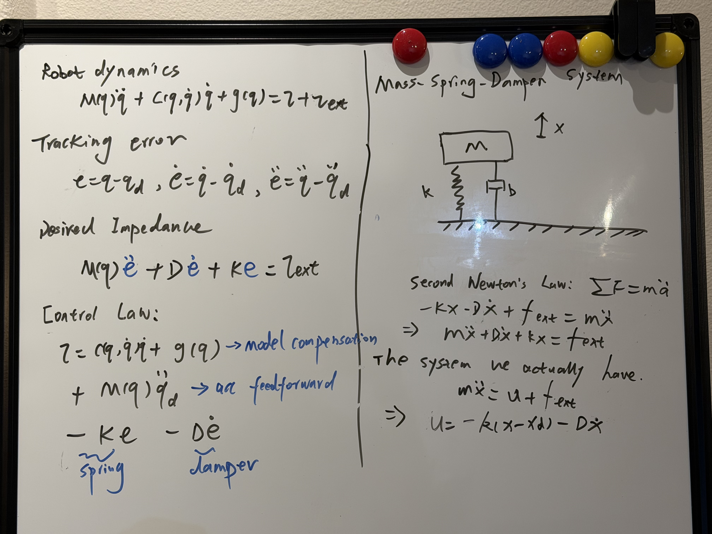

# What the heck is Impedance Control?

Written by Codex

Whiteboard notes: from a mass–spring–damper to joint-space impedance control. Click the figure to view it full size.

A mass attached to a spring and damper already knows how to respond to a push: it moves, resists displacement, and dissipates motion. Impedance control starts by choosing this kind of mechanical response, then uses feedback to make a robot exhibit it.

The progression here is physical system → desired behavior → feedback law → contact with an environment. Start in one dimension, where every force and sign can be checked, before moving to a robot arm.

## 1. Start with a real mass, spring, and damper

Consider a mass $m$ sliding horizontally without friction. A spring and damper connect it to a fixed support. Let $x_d$ be the mass position at which the spring is unstretched, $x$ its current position, and $e=x-x_d$ its displacement. Positive force points in the positive $x$ direction.

The spring pulls back toward its rest position. The damper opposes velocity:

$$
f_{\mathrm{spring}}=-Ke,\qquad f_{\mathrm{damper}}=-D\dot{x}.
$$

Here $K>0$ is stiffness in $\mathrm{N/m}$, and $D\ge0$ is damping in $\mathrm{N\,s/m}$. The spring stores energy when displaced; the damper dissipates energy when moving. Neither term requires a controller: these are physical component laws.

Let $f_{\mathrm{ext}}$ be the force applied *to the mass* from outside. Newton's law adds the forces:

$$
\begin{aligned}
m\ddot{x}&=f_{\mathrm{ext}}-D\dot{x}-K(x-x_d),\\
\boxed{m\ddot{e}+D\dot{e}+Ke}&=\boxed{f_{\mathrm{ext}}}.
\end{aligned}
$$

The second line uses a fixed $x_d$, so $\dot e=\dot x$ and $\ddot e=\ddot x$. It specifies the entire dynamic response to an external force.

## 2. Understand what each parameter changes

**Stiffness sets the displacement under a sustained load.** With a constant force $F$ and positive damping, the system settles to

$$
\dot e=\ddot e=0\quad\Longrightarrow\quad e_\infty=\frac{F}{K}.
$$

For example, $F=10\,\mathrm N$ and $K=200\,\mathrm{N/m}$ give $e_\infty=0.05\,\mathrm m$. Doubling stiffness halves the displacement. Damping and mass do not change this static equilibrium.

**Mass sets the initial acceleration.** If the mass starts at rest at $x_d$, immediately after applying the force, spring and damping forces are both zero. Therefore $\ddot e(0^+)=F/m$.

**Damping determines how motion dies out.** The spring alone can exchange energy with the moving mass indefinitely. Damping removes that energy. The characteristic equation and its useful parameters are

$$
m r^2+Dr+K=0,\qquad
\omega_n=\sqrt{K/m},\qquad\zeta=\frac{D}{2\sqrt{mK}}.
$$

| Damping ratio | Response in this ideal system |
| --- | --- |
| $\zeta=0$ | Undamped oscillation; generally no settling. |
| $0<\zeta<1$ | Oscillations decay; a force step produces overshoot. |
| $\zeta=1$ | Critical damping; boundary between oscillatory and nonoscillatory responses. |
| $\zeta>1$ | Overdamped; a step from rest approaches equilibrium without overshoot, with a slow mode that becomes slower as damping grows. |

To choose damping from a target ratio, use $D=2\zeta\sqrt{mK}$. This scalar rule assumes the model above; coupled robot dynamics require more care.

[Interactive figure: Interactive mass–spring–damper response to a force step or release](../figures/impedance-control.html)

Change one parameter at a time. A force step starts from rest and applies $10\,\mathrm N$; release starts from a $5\,\mathrm{cm}$ displacement with no external force. Scrub time to inspect the motion and force balance. The schematic rescales its displacement for visibility; the plot reports centimeters. This is an ideal scalar model, not a hardware simulation.

**Try three experiments.** Increase $K$ to reduce the loaded equilibrium displacement. Increase $m$ to reduce initial acceleration. Increase $D$ from zero to see persistent oscillation become a decaying response. Holding the other parameters fixed changes $\zeta$ as well, so these effects are coupled.

## 3. Why call this an impedance?

Mechanical impedance describes the relationship between applied force and resulting motion. For the linear system above, with a fixed reference and zero initial conditions, let $s$ be the Laplace variable. Force divided by velocity gives

$$
Z(s)=\frac{F_{\mathrm{ext}}(s)}{V(s)}
=ms+D+\frac{K}{s}.
$$

The mass, damper, and spring contribute different frequency-dependent responses. The related displacement response is

$$
\frac{E(s)}{F_{\mathrm{ext}}(s)}=\frac1{ms^2+Ds+K},
$$

where $E(s)$ is the transform of displacement error. Thus stiffness is only one part of impedance. A robot can yield under a sustained force yet react quite differently to a sudden impact, depending on its inertia and damping.

## 4. Why would we want a robot to behave this way?

During contact, the environment constrains motion. A peg encounters a hole edge; a finger touches an object earlier than expected. If the controller strongly resists every position error, a small geometric mismatch can produce a large contact force.

The mass–spring–damper model offers a behavior we can specify: the robot pulls toward a reference, yields under load by a chosen amount, and damps the resulting motion. **We choose how force and motion relate during interaction.** This is the motivation for impedance control, developed in [Hogan's foundational work](https://newmanlab.mit.edu/wp-content/uploads/2017/09/1985-impedance-control-an-approach-to-manipulation-part-I-theory.pdf) and illustrated in [MIT's manipulation notes](https://manipulation.mit.edu/force.html).

The reference $x_d$ is now an equilibrium position the controller prefers. Contact may prevent the robot from reaching it, and a nonzero displacement can be the intended response.

## 5. Replace the physical spring and damper with feedback

Remove the real spring and damper. Suppose an actuator can command force $u$ on the same mass:

$$
m\ddot{x}=u+f_{\mathrm{ext}}.
$$

We want the closed-loop equation to look like the physical system. Choose

$$
u=-K(x-x_d)-D\dot{x}.
$$

Substitution gives exactly

$$
m\ddot{x}+D\dot{x}+K(x-x_d)=f_{\mathrm{ext}}.
$$

The actuator creates a *virtual* spring and damper using measured position and velocity. This is PD feedback with a mechanical interpretation. It shapes stiffness and damping while retaining the physical mass $m$; it is often called stiffness control, or an impedance controller without inertia shaping.

**External force sensing is not required for this ideal implementation.** The force enters the plant physically, and the controller responds to the resulting motion. Gravity, friction, actuator dynamics, and measurement errors were excluded from this simple model; compensating or accounting for them is part of a real implementation.

## 6. A moving reference needs a careful derivation

Let $x_d(t)$ move, and keep $e=x-x_d$. We may want the same force-to-error dynamics:

$$
m\ddot e+D\dot e+Ke=f_{\mathrm{ext}}.
$$

Since $\ddot x=\ddot e+\ddot x_d$, the force law that realizes this target is

$$
u=m\ddot x_d-D(\dot x-\dot x_d)-K(x-x_d).
$$

The acceleration feedforward supplies the force needed to move the reference trajectory. Omitting it gives $m\ddot e+D\dot e+Ke=f_{\mathrm{ext}}-m\ddot x_d$. The spring–damper intuition still helps, but the exact target equation has changed.

## 7. What if we also want to choose the apparent mass?

Now prescribe a desired impedance with $M_d>0$, $D_d>0$, and $K_d>0$:

$$
M_d\ddot e+D_d\dot e+K_de=f_{\mathrm{ext}}.
$$

Solve for the required acceleration and substitute it into $u=m\ddot x-f_{\mathrm{ext}}$:

$$
\begin{aligned}
\ddot x&=\ddot x_d+\frac{f_{\mathrm{ext}}-D_d\dot e-K_de}{M_d},\\
u&=m\ddot x_d-\frac{m}{M_d}(D_d\dot e+K_de)
+\left(\frac{m}{M_d}-1\right)f_{\mathrm{ext}}.
\end{aligned}
$$

In this ideal scalar realization, changing apparent inertia requires knowledge of $m$ and measured or estimated external force. When $M_d=m$, the force-feedback term disappears and we recover the preceding controller. Choosing gains alone does not independently choose all three mechanical parameters.

## 8. Contact force is determined by both robot and environment

Let a compliant wall begin at $x_w$. When the robot penetrates its surface, model the environmental reaction as $f_{\mathrm{ext}}=-K_e(x-x_w)$, with $K_e>0$. Take a fixed reference $x_d>x_w$, and assume contact remains active.

At equilibrium, the robot's virtual spring force balances the wall force:

$$
\begin{aligned}
K(x_d-x)&=K_e(x-x_w),\\
x_*&=\frac{Kx_d+K_ex_w}{K+K_e},\\
F_{\mathrm{contact}}&=\frac{KK_e}{K+K_e}(x_d-x_w).
\end{aligned}
$$

Here $F_{\mathrm{contact}}$ is the positive force the robot applies to the wall; the wall applies its negative to the robot. The effective static stiffness is the series combination of robot and environment stiffnesses.

For a very stiff wall, $x_*\approx x_w$ and $F_{\mathrm{contact}}\approx K(x_d-x_w)$. A $5\,\mathrm{mm}$ offset produces approximately $1\,\mathrm N$ at $K=200\,\mathrm{N/m}$, or $10\,\mathrm N$ at $K=2000\,\mathrm{N/m}$.

This is why reference placement and stiffness both matter. Impedance control does not automatically regulate a specified contact force; the force also depends on environmental geometry and compliance. Damping affects the contact transient, but vanishes from this static balance.

## 9. Lift the virtual spring into a robot arm

For joint coordinates $q$, write the robot dynamics as

$$
M(q)\ddot q+C(q,\dot q)\dot q+g(q)
=\tau+J(q)^\top F_{\mathrm{ext}}.
$$

Here $x=h(q)\in\mathbb R^3$ is the end-effector position, $\dot x=J(q)\dot q$, and $F_{\mathrm{ext}}$ is an external translational force expressed in the same frame as $x$. A simple gravity-compensated Cartesian spring–damper controller for fixed $x_d$ is

$$
\begin{aligned}
F_{\mathrm{cmd}}&=-K(x-x_d)-D\dot x,\\
\tau&=g(q)+J(q)^\top F_{\mathrm{cmd}}.
\end{aligned}
$$

The Jacobian transpose converts task-space force into joint torque. The power identity explains why: $F_{\mathrm{cmd}}^\top\dot x=(J^\top F_{\mathrm{cmd}})^\top\dot q$. See [Modern Robotics](https://modernrobotics.northwestern.edu/nu-gm-book-resource/11-5-force-control/) for this force–torque mapping.

Positive-definite matrices $K$ and $D$ allow different responses in different directions. A peg-insertion controller, for example, may permit more lateral motion while maintaining stronger guidance along another axis.

The arm's inertia remains coupled and configuration-dependent. This torque law does not by itself realize an arbitrary constant Cartesian $M_d$. Orientation control also needs a suitable rotational error representation, and redundant joints need an additional posture objective; these are extensions of the scalar intuition.

### A two-link arm in a horizontal plane

Make the mapping concrete with two revolute joints. Let $q_1$ be the first link's angle from the positive horizontal axis and $q_2$ the second link's angle relative to the first. For lengths $l_1,l_2$, the hand position $\mathbf x=[x,y]^\top$ is

$$
\mathbf x(q)=\begin{bmatrix}
l_1\cos q_1+l_2\cos(q_1+q_2)\\
l_1\sin q_1+l_2\sin(q_1+q_2)
\end{bmatrix}.
$$

Differentiate with respect to the joint angles to obtain the Jacobian:

$$
J(q)=\begin{bmatrix}
-l_1\sin q_1-l_2\sin(q_1+q_2)&-l_2\sin(q_1+q_2)\\
l_1\cos q_1+l_2\cos(q_1+q_2)&l_2\cos(q_1+q_2)
\end{bmatrix}.
$$

Choose $K=\operatorname{diag}(K_x,K_y)$ and $D=dI$. The simulation evaluates the following sequence at every integration step:

$$
\begin{aligned}
\mathbf e&=\mathbf x(q)-\mathbf x_d,\qquad \dot{\mathbf x}=J(q)\dot q,\\
F_{\mathrm{cmd}}&=-K\mathbf e-d\dot{\mathbf x},\\
\tau&=J(q)^\top F_{\mathrm{cmd}},\\
\ddot q&=M(q)^{-1}\!\left[\tau+J(q)^\top F_{\mathrm{ext}}-C(q,\dot q)\dot q\right].
\end{aligned}
$$

The arm moves in a horizontal plane, so gravity contributes no joint torque. The hand moves because the applied torques accelerate the links. The dashed target pose is only a reference; it does not determine the simulated joint trajectory.

[Interactive figure: Interactive two-link arm with Cartesian impedance control and external pushes](../figures/impedance-arm.html)

Solid links show the simulated arm; dashed links show a pose at the desired hand position. The cross marks the target, the blue arrow is the controller force, and the orange arrow is the external force applied to the hand. Adjust the target and gains, choose a push or a target-only experiment, then play or scrub time. The curves show horizontal and vertical hand errors.

**Start with a downward push.** Select “Push from 0.5 s and hold” and inspect the end of the rollout. Once the nonsingular arm settles, $J^\top(F_{\mathrm{cmd}}+F_{\mathrm{ext}})=0$ implies

$$
\mathbf x_* -\mathbf x_d=K^{-1}F_{\mathrm{ext}}.
\qquad F_{\mathrm{ext}}=\begin{bmatrix}0\\-3\end{bmatrix}\mathrm N,\quad K_y=40\,\mathrm{N/m}
\ \Longrightarrow\ y_*-y_d=-0.075\,\mathrm m.
$$

Increase $K_y$ to $120\,\mathrm{N/m}$: the predicted vertical offset becomes $-2.5\,\mathrm{cm}$. Changing $K_x$ instead does not change this vertical equilibrium offset, although the coupled arm can have a different transient. The default push-and-release experiment removes the force at $2.5\,\mathrm s$, allowing the hand to return toward its target.

This equilibrium relation assumes the displaced target is reachable and the Jacobian has full rank. Near a fully extended arm, or when the required equilibrium lies outside its workspace, the robot cannot realize an arbitrary Cartesian displacement.

**Then move the target.** Select the experiment without an external push and change the target coordinates. Observe how a Cartesian error produces two motor torques. The arm's trajectory reflects its coupled inertia and need not be a straight line between hand positions.

**Model and numerical details**

The two uniform rods have lengths $l_1=0.60\,\mathrm m$, $l_2=0.45\,\mathrm m$ and masses $m_1=1.0\,\mathrm{kg}$, $m_2=0.7\,\mathrm{kg}$. Their center-of-mass distances are $c_i=l_i/2$, and their planar inertias are $I_i=m_il_i^2/12$. Define

$$
\begin{aligned}
A&=I_1+I_2+m_1c_1^2+m_2(l_1^2+c_2^2),\\
B&=m_2l_1c_2,\qquad H=I_2+m_2c_2^2.
\end{aligned}
$$

The simulated inertia matrix and Coriolis/centrifugal vector are

$$
\begin{aligned}
M(q)&=\begin{bmatrix}A+2B\cos q_2&H+B\cos q_2\\H+B\cos q_2&H\end{bmatrix},\\
C(q,\dot q)\dot q&=B\sin q_2\begin{bmatrix}-2\dot q_1\dot q_2-\dot q_2^2\\\dot q_1^2\end{bmatrix}.
\end{aligned}
$$

These follow from the rigid-body kinetic energy using the [Lagrangian manipulator equations](https://underactuated.mit.edu/multibody.html). Every rollout starts at rest with the hand at $(0.65,0.25)\,\mathrm m$, using the branch with $q_2>0$. Integration uses fourth-order Runge–Kutta with a $1\,\mathrm{ms}$ step. The model includes joint inertia and coupling, but assumes ideal torque actuation and omits friction, joint limits, and collision geometry. The push is a prescribed external force, not a simulated wall contact.

## 10. The energy interpretation explains the damping

Return to the fixed-reference scalar system. Its stored energy is

$$
\mathcal H=\tfrac12m\dot e^2+\tfrac12Ke^2.
$$

Differentiate and substitute the equation of motion:

$$
\dot{\mathcal H}
=\dot e(m\ddot e+Ke)
=f_{\mathrm{ext}}\dot e-D\dot e^2.
$$

External force supplies power $f_{\mathrm{ext}}\dot e$; damping removes power $D\dot e^2$. The ideal system is passive at its force–velocity interface. With no external input and $D>0$, it dissipates energy and converges to the spring equilibrium.

This explains why fixed spring–damper behavior is useful for interaction. It does not establish stability for every digital implementation. Delays, inner control loops, and filtering affect achievable impedance, as analyzed in [robot impedance control and passivity analysis](https://arxiv.org/abs/1406.4047). Moving the reference or changing stiffness can also inject energy; the fixed-reference argument must then be extended.

## 11. Impedance and admittance use different controller interfaces

The same desired mechanical equation can be implemented in different ways:

| Typical implementation | Controller computation |
| --- | --- |
| Impedance | Measure motion; compute force or torque commands that create the desired mechanical response. |
| Admittance | Measure external force; integrate a virtual mechanical model to generate a motion reference for an inner tracking controller. |

These are common architectural distinctions. The equation alone does not identify the implementation. In either case, the realized interaction depends on the robot and its inner control loops.

## 12. Check the physical picture

- **A constant force creates a steady offset.** Its size is $F/K$, not a failure to implement the chosen impedance.

- **Damping does not change that offset.** It changes how the system reaches it.

- **A PD controller can create a virtual spring and damper.** The impedance interpretation specifies the interaction behavior of the resulting closed loop.

- **The desired equation is a design target.** Derive the actuator command from the plant dynamics, then check which assumptions make the target achievable.

A useful exercise: keep $K$ and $D$ fixed and increase the mass in the visualization. Predict what happens to the initial acceleration, steady displacement, and damping ratio before moving the slider.
